<div align="center">
  
  <h1 align="center">🚦 AdGuard 360: A Tech-Enabled Framework for Billboard Compliance</h1>
  <p align="center">
    A technology-driven solution to combat unauthorized billboards in urban landscapes, developed for the <strong>Technova Season 2 Hackathon</strong>.
  </p>

  <!-- Badges -->

  <p align="center">
    
    
    
    
    
    
    
    
  </p>
</div>

---

## 🎯 Project Overview

Unauthorized billboards are a growing menace in Indian cities — contributing to accidents, diminishing aesthetics, and spreading misinformation. Enforcement is often difficult due to **manual processes** and **lack of public reporting mechanisms**.

**AdGuard 360** provides a **smart, scalable, mobility-based detection system** that empowers citizens to report non-compliant billboards and enables authorities to enforce regulations efficiently.

---

## ✨ Key Features

* **📸 Smart Detection:** Upload images of billboards for AI-driven analysis.
* **✅ Violation Identification:** Detects incorrect dimensions, unsafe placement, structural hazards, and content violations.
* **🤝 Citizen Engagement:** Easy-to-use mobile-first app for public participation.
* **📊 Centralized Dashboard:** Authorities can view, verify, and manage all reports in real-time.
* **🏆 Gamification:** Leaderboards encourage citizen participation.

---

## 🏗️ System Architecture

```mermaid
flowchart TB
    subgraph MobileApp["📱 Mobile App (React Native)"]
        A1[Camera]
        A2[GPS]
        A3[Reporting]
    end

    subgraph WebDashboard["💻 Web Dashboard (React)"]
        B1[Analytics]
        B2[Maps]
        B3[Management]
    end

    subgraph AIService["🤖 AI Service (Python)"]
        C1[Computer Vision]
        C2[Detection]
    end

    subgraph Backend["🌐 Backend API (Node.js)"]
        D1[Authentication]
        D2[Report Management]
        D3[Real-time Processing]
        D4[File Upload]
    end

    subgraph Database["🗄️ Database (MongoDB + Redis)"]
        E1[(MongoDB)]
        E2[(Redis)]
    end

    MobileApp --> Backend
    WebDashboard --> Backend
    AIService --> Backend
    Backend --> Database
```



---

## 🛠️ Tech Stack

**Frontend:**

* [React Native](https://reactnative.dev/) – Mobile App
* [Next.js](https://nextjs.org/) / [React](https://reactjs.org/) – Dashboard
* [Tailwind CSS](https://tailwindcss.com/) – Styling

**Backend:**

* [Node.js](https://nodejs.org/) + [Express.js](https://expressjs.com/)

**AI / Machine Learning:**

* [Python](https://www.python.org/) – Computer Vision Services

**Database:**

* [MongoDB](https://www.mongodb.com/) – Storage
* [Redis](https://redis.io/) – Cache & Real-time Messaging

---

## 🚀 Getting Started

### Prerequisites

* Node.js (v16+)
* npm / yarn

### Installation

```sh
# Clone the repo
git clone https://github.com/AnuragRaj11/AdGuard-360.git

# Navigate into the project
cd AdGuard-360

# Install dependencies
npm install

# Start development server
npm run dev
```

Visit 👉 [http://localhost:3000](http://localhost:3000)

---

## ⚖️ Data Ethics & Privacy

* Built from scratch with no external public codebases.
* No **facial recognition** or **public surveillance**.
* Users are informed about **data usage & privacy policies** before submitting reports.

---

## 🙏 Acknowledgments

* Submission for **Technova Season 2 Hackathon**
* Special thanks to **ESSPL** for organizing

---
